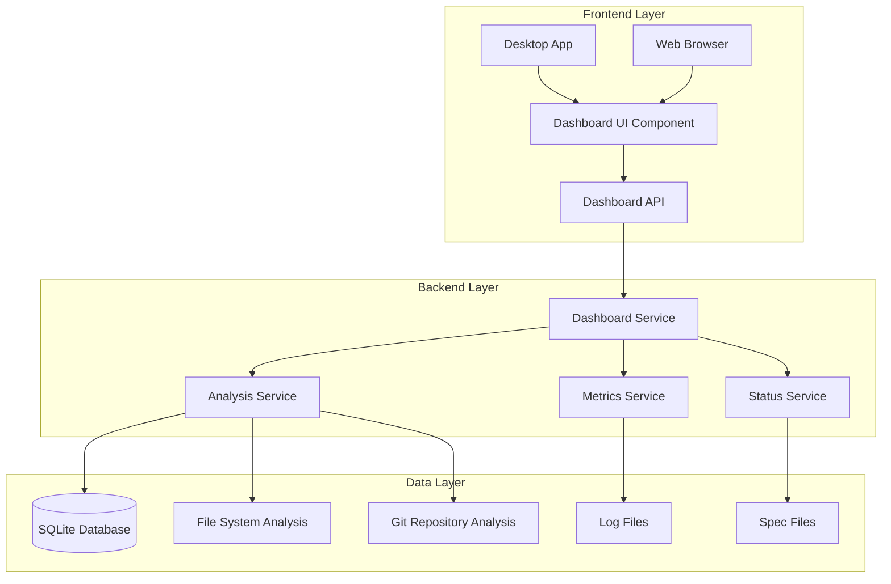

# Development Status Dashboard - Design Document

## Overview

The Development Status Dashboard is a comprehensive web-based interface that provides real-time visibility into the RAG Smart Folder application's development progress. It will be implemented as a new route in the existing FastAPI backend with a dedicated frontend component that can be accessed through both the desktop app and directly via web browser.

Based on the analysis of the current application, the dashboard will track:
- **Completed Features**: File scanning, duplicate detection, perceptual hashing, desktop app, Docker support
- **In-Progress Features**: Enhanced duplicate detection (90% complete), file scanning fixes (100% complete)
- **Planned Features**: RAG integration, web interface, quarantine system, batch operations
- **Component Health**: Backend API, database, desktop app, test suite

## Architecture

### High-Level Architecture



### Component Integration

The dashboard will integrate with existing components:
- **FastAPI Backend**: New `/dashboard` endpoints
- **SQLite Database**: Query existing tables for metrics
- **Spec System**: Parse `.kiro/specs/` for feature status
- **Test Suite**: Analyze test results and coverage
- **Git Repository**: Extract commit history and development metrics

## Components and Interfaces

### 1. Dashboard Service (`DashboardService`)

**Purpose**: Central service for aggregating and serving dashboard data

**Key Methods**:
```python
class DashboardService:
    def get_development_overview() -> DevelopmentOverview
    def get_feature_status() -> List[FeatureStatus]
    def get_component_health() -> ComponentHealth
    def get_development_metrics() -> DevelopmentMetrics
    def get_roadmap_items() -> List[RoadmapItem]
    def refresh_dashboard_data() -> None
```

**Dependencies**: Analysis Service, Metrics Service, Status Service

### 2. Analysis Service (`AnalysisService`)

**Purpose**: Analyzes codebase, specs, and repository for development insights

**Key Methods**:
```python
class AnalysisService:
    def analyze_spec_progress() -> Dict[str, SpecProgress]
    def analyze_code_coverage() -> CoverageReport
    def analyze_git_history() -> GitMetrics
    def analyze_component_health() -> Dict[str, ComponentStatus]
    def calculate_technical_debt() -> TechnicalDebtReport
```

### 3. Metrics Service (`MetricsService`)

**Purpose**: Collects and calculates development metrics and statistics

**Key Methods**:
```python
class MetricsService:
    def get_productivity_metrics() -> ProductivityMetrics
    def get_quality_metrics() -> QualityMetrics
    def get_performance_metrics() -> PerformanceMetrics
    def calculate_velocity() -> VelocityMetrics
    def track_milestone_progress() -> MilestoneProgress
```

### 4. Status Service (`StatusService`)

**Purpose**: Monitors real-time status of application components

**Key Methods**:
```python
class StatusService:
    def check_backend_health() -> HealthStatus
    def check_database_health() -> DatabaseStatus
    def check_desktop_app_status() -> AppStatus
    def check_test_suite_status() -> TestStatus
    def get_system_resources() -> ResourceStatus
```

### 5. Dashboard UI Component

**Purpose**: React-based frontend component for displaying dashboard data

**Key Features**:
- Responsive design compatible with desktop app and web browser
- Real-time updates using WebSocket or polling
- Interactive charts and visualizations
- Drill-down capabilities for detailed information
- Export functionality for reports

## Data Models

### Core Data Models

```python
@dataclass
class FeatureStatus:
    name: str
    description: str
    status: FeatureStatusEnum  # COMPLETED, IN_PROGRESS, PLANNED, BLOCKED
    completion_percentage: float
    tasks_completed: int
    tasks_total: int
    last_updated: datetime
    assigned_developer: Optional[str]
    estimated_completion: Optional[datetime]
    dependencies: List[str]
    spec_path: Optional[str]

@dataclass
class ComponentHealth:
    component_name: str
    status: HealthStatusEnum  # HEALTHY, WARNING, ERROR, UNKNOWN
    last_check: datetime
    error_count: int
    performance_score: float
    uptime_percentage: float
    details: Dict[str, Any]

@dataclass
class DevelopmentMetrics:
    total_features: int
    completed_features: int
    in_progress_features: int
    planned_features: int
    code_coverage_percentage: float
    test_pass_rate: float
    bugs_fixed_this_week: int
    commits_this_week: int
    lines_of_code: int
    technical_debt_score: float

@dataclass
class RoadmapItem:
    title: str
    description: str
    priority: PriorityEnum  # HIGH, MEDIUM, LOW
    estimated_effort: str  # "1 week", "2 sprints", etc.
    dependencies: List[str]
    target_milestone: Optional[str]
    status: RoadmapStatusEnum  # PLANNED, APPROVED, IN_DESIGN, BLOCKED
```

### Database Schema Extensions

New tables to support dashboard functionality:

```sql
-- Track feature development history
CREATE TABLE feature_history (
    id INTEGER PRIMARY KEY AUTOINCREMENT,
    feature_name TEXT NOT NULL,
    status TEXT NOT NULL,
    completion_percentage REAL,
    updated_at TIMESTAMP DEFAULT CURRENT_TIMESTAMP,
    notes TEXT
);

-- Store component health checks
CREATE TABLE component_health_log (
    id INTEGER PRIMARY KEY AUTOINCREMENT,
    component_name TEXT NOT NULL,
    status TEXT NOT NULL,
    metrics_json TEXT,
    checked_at TIMESTAMP DEFAULT CURRENT_TIMESTAMP
);

-- Track development metrics over time
CREATE TABLE development_metrics_history (
    id INTEGER PRIMARY KEY AUTOINCREMENT,
    metric_name TEXT NOT NULL,
    metric_value REAL NOT NULL,
    recorded_at TIMESTAMP DEFAULT CURRENT_TIMESTAMP
);
```

## Error Handling

### Error Categories

1. **Data Collection Errors**
   - Spec file parsing failures
   - Git repository access issues
   - Database query failures
   - File system access problems

2. **Analysis Errors**
   - Code coverage calculation failures
   - Metric computation errors
   - Component health check timeouts
   - Invalid configuration data

3. **UI Errors**
   - Dashboard rendering failures
   - Data refresh timeouts
   - WebSocket connection issues
   - Export functionality errors

### Error Handling Strategy

```python
class DashboardErrorHandler:
    def handle_data_collection_error(self, error: Exception, source: str):
        # Log error, use cached data if available, show warning in UI
        
    def handle_analysis_error(self, error: Exception, analysis_type: str):
        # Log error, return partial results, mark affected sections as unavailable
        
    def handle_ui_error(self, error: Exception, component: str):
        # Show user-friendly error message, provide retry option, fallback to basic view
```

## Testing Strategy

### Unit Tests
- Test each service class independently
- Mock external dependencies (file system, git, database)
- Validate data model serialization/deserialization
- Test error handling scenarios

### Integration Tests
- Test end-to-end dashboard data flow
- Validate API endpoints with real data
- Test UI component rendering with various data states
- Test real-time update mechanisms

### Performance Tests
- Test dashboard load times with large datasets
- Validate memory usage during data analysis
- Test concurrent user access scenarios
- Benchmark metric calculation performance

## Implementation Phases

### Phase 1: Core Infrastructure (Week 1)
- Implement basic service classes
- Create database schema extensions
- Set up API endpoints
- Basic UI component structure

### Phase 2: Data Analysis (Week 2)
- Implement spec file analysis
- Add git repository analysis
- Create code coverage integration
- Implement component health checks

### Phase 3: UI Development (Week 3)
- Complete dashboard UI components
- Add interactive charts and visualizations
- Implement real-time updates
- Add responsive design

### Phase 4: Advanced Features (Week 4)
- Add technical debt analysis
- Implement export functionality
- Add historical trend analysis
- Performance optimization

## Security Considerations

- **Access Control**: Dashboard should respect existing authentication if implemented
- **Data Sanitization**: Sanitize all file paths and git data before display
- **Rate Limiting**: Implement rate limiting for dashboard API endpoints
- **Sensitive Data**: Avoid exposing sensitive configuration or credentials

## Performance Considerations

- **Caching**: Cache analysis results for 5-10 minutes to avoid repeated expensive operations
- **Lazy Loading**: Load dashboard sections on-demand to improve initial load time
- **Background Processing**: Run expensive analysis tasks in background threads
- **Data Pagination**: Paginate large datasets (git history, test results) to improve performance

## Monitoring and Observability

- **Dashboard Metrics**: Track dashboard usage, load times, and error rates
- **Health Monitoring**: Monitor the health of the dashboard service itself
- **Performance Monitoring**: Track analysis execution times and resource usage
- **User Analytics**: Track which dashboard sections are most frequently accessed